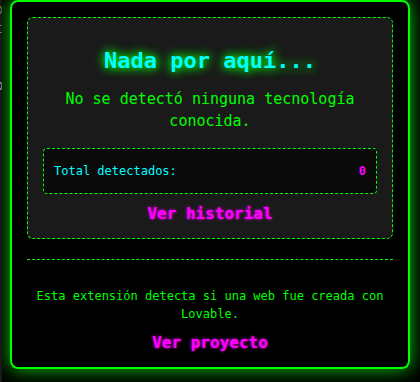

# TE PILLÉ - EXTENSIÓN DETECTORA DE LOVABLE



Esta extensión de navegador está diseñada para detectar si un sitio web está construido utilizando el framework Lovable.

**Autor:** 686f6c61
**Repositorio:** https://github.com/686f6c61/lovable-detector-extension
**Versión:** 1.2
**Licencia:** MIT

---

## TABLA DE CONTENIDOS

1. [Cómo Funciona](#cómo-funciona)
2. [Características](#características)
3. [Instalación](#instalación)
4. [Uso](#uso)
5. [Arquitectura Técnica](#arquitectura-técnica)
6. [Estructura del Proyecto](#estructura-del-proyecto)
7. [Tecnologías Utilizadas](#tecnologías-utilizadas)
8. [Contribución](#contribución)
9. [Licencia](#licencia)

---

## CÓMO FUNCIONA

La extensión opera analizando múltiples indicadores en el código fuente de la página web que se está visitando. Utiliza **11 métodos diferentes** de detección para identificar si un sitio fue construido con Lovable, incluyendo soporte completo para **Single Page Applications (SPAs)**.

### MÉTODOS DE DETECCIÓN

#### 1. META TAG KEYWORDS
Busca etiquetas meta keywords que contengan "lovable":
```html
<meta name="keywords" content="...lovable...">
```

#### 2. META TAG GENERATOR
Detecta cuando el generador es Lovable:
```html
<meta name="generator" content="Lovable">
```

#### 3. META TAG AUTHOR
Identifica cuando el autor es Lovable:
```html
<meta name="author" content="Lovable">
```

#### 4. META TAG DESCRIPTION
Busca referencias a Lovable en la descripción:
```html
<meta name="description" content="...lovable...">
```

#### 5. SCRIPTS CON DOMINIO LOVABLE.APP
Detecta scripts cargados desde dominios de Lovable:
```html
<script src="https://wanderlust-connect-tribe.lovable.app/~flock.js"></script>
```

#### 6. LINKS CON DOMINIO LOVABLE
Identifica hojas de estilo u otros recursos de Lovable:
```html
<link href="https://...lovable..." rel="stylesheet">
```

#### 7. RECURSOS LOVABLE-UPLOADS
Detecta recursos alojados en el CDN de Lovable:
```html
<link rel="icon" href="/lovable-uploads/2ac905d4-de72-44a5-b3a9-9d97c5283e75.png">
```

#### 8. COMENTARIOS HTML
Detecta comentarios en el código fuente que mencionen Lovable:
```html
<!-- Built with Lovable -->
```

#### 9. CLASES CSS E IDS
Identifica elementos del DOM con clases o IDs relacionados:
```html
<div class="lovable-container">
<div id="lovable-app">
```

#### 10. ATRIBUTOS DATA
Busca atributos personalizados de datos:
```html
<div data-lovable="true">
<div data-framework="lovable">
```

#### 11. ANÁLISIS COMPLETO DEL CÓDIGO FUENTE
Como último recurso, busca la palabra "lovable" en cualquier parte del HTML.

### CARACTERÍSTICAS AVANZADAS DE DETECCIÓN

#### DETECCIÓN EN SINGLE PAGE APPLICATIONS (SPAs)
La extensión incluye un sistema completo para detectar Lovable en SPAs que navegan sin recargar la página:

- **Interceptación de History API:** Detecta llamadas a `pushState()` y `replaceState()`
- **Listener de popstate:** Captura navegación con botones atrás/adelante
- **Polling de URL:** Verifica cambios de ruta cada 500ms
- **Re-detección automática:** Ejecuta nueva detección tras navegación con delay inteligente

#### DETECCIÓN DINÁMICA DE CONTENIDO
Implementa un MutationObserver que monitorea cambios en el DOM para detectar contenido cargado de forma asíncrona. Utiliza debounce de 1 segundo para optimizar el rendimiento.

#### DETECCIÓN CASE-INSENSITIVE
Todas las búsquedas son insensibles a mayúsculas y minúsculas para mayor flexibilidad y precisión.

#### OPTIMIZACIÓN DE MENSAJES
Solo envía notificaciones al background script cuando el estado de detección cambia, evitando mensajes duplicados.

### INDICADOR VISUAL

Cuando se detecta un sitio web construido con Lovable, el icono de la extensión en la barra de herramientas del navegador cambia automáticamente, proporcionando retroalimentación visual inmediata al usuario.

---

## CARACTERÍSTICAS

### DETECCIÓN AVANZADA

- **Detección múltiple:** Utiliza 11 métodos diferentes para identificar sitios Lovable
- **Soporte completo para SPAs:** Detecta navegación en Single Page Applications
- **Insensible a mayúsculas:** Detecta variaciones en mayúsculas y minúsculas
- **Detección en tiempo real:** Monitorea cambios dinámicos en el DOM con debounce
- **Indicador visual:** Cambia el icono de la extensión al detectar un framework
- **Alta precisión:** Reduce falsos negativos mediante múltiples verificaciones
- **Detección de recursos:** Identifica scripts, links y recursos de Lovable
- **Optimización inteligente:** Solo notifica cuando el estado de detección cambia

### INTERFAZ DE USUARIO

- **Estética hacker:** Tema visual distintivo con colores neón y animaciones CSS3
- **Animaciones sutiles:** Efectos de entrada suave, resplandor y pulsación
- **Diseño adaptable:** Se adapta a diferentes tamaños de ventana
- **Estados de carga:** Indicadores visuales con spinner animado
- **Navegación intuitiva:** Transiciones fluidas entre vistas

### HISTORIAL Y ESTADÍSTICAS

- **Historial de detecciones:** Almacena las últimas 100 detecciones con URL y marca temporal
- **Estadísticas en tiempo real:** Contador total de sitios Lovable detectados
- **Visualización organizada:** Interfaz limpia para explorar el historial completo
- **Ordenamiento temporal:** Muestra las detecciones más recientes primero
- **Persistencia de datos:** Los datos se mantienen entre sesiones del navegador

### SEGURIDAD Y RENDIMIENTO

- **Content Security Policy:** Protección contra ataques XSS
- **Sanitización de HTML:** Prevención de inyecciones de código malicioso
- **Carga diferida con caché:** Optimización del rendimiento mediante lazy loading
- **Manejo robusto de errores:** Bloques try-catch en todas las operaciones críticas
- **Validación de contexto:** Verificación de pestañas antes de ejecutar operaciones

---

## INSTALACIÓN

### REQUISITOS PREVIOS

- Navegador compatible: Google Chrome, Microsoft Edge, Brave u otro navegador basado en Chromium
- Versión mínima: Chrome 88+ (soporte para Manifest V3)

### PASOS DE INSTALACIÓN

1. **Descargar el proyecto**
   ```bash
   git clone https://github.com/686f6c61/lovable-detector-extension.git
   ```

   O descargue el archivo ZIP desde el repositorio y extráigalo.

2. **Abrir la página de extensiones del navegador**
   - Chrome: Navegue a `chrome://extensions`
   - Edge: Navegue a `edge://extensions`
   - Brave: Navegue a `brave://extensions`

3. **Activar el modo de desarrollador**
   - Busque el interruptor "Modo de desarrollador" en la esquina superior derecha
   - Actívelo

4. **Cargar la extensión**
   - Haga clic en el botón "Cargar extensión sin empaquetar"
   - Seleccione la carpeta `lovable-detector-extension` que descargó
   - La extensión debería aparecer en la lista de extensiones instaladas

5. **Verificar la instalación**
   - El icono de la extensión debería aparecer en la barra de herramientas
   - Haga clic en el icono para abrir el popup y confirmar que funciona

### SOLUCIÓN DE PROBLEMAS

- **Error de manifest:** Asegúrese de seleccionar la carpeta raíz del proyecto que contiene `manifest.json`
- **Permisos denegados:** Verifique que el modo de desarrollador esté activado
- **Extensión no visible:** Ancle la extensión a la barra de herramientas desde el menú de extensiones

---

## USO

### USO BÁSICO

1. Navegue por la web de forma normal
2. Cuando visite una página construida con Lovable, el icono de la extensión cambiará automáticamente
3. Haga clic en el icono para ver los detalles de la detección

### VISTA PRINCIPAL

Al abrir el popup, verá una de estas dos vistas:

#### DETECCIÓN POSITIVA
- Título: "¡Te Pillé!"
- Mensaje confirmando que el sitio usa Lovable
- Estadísticas: Total de detecciones y URL actual
- Enlace para ver el historial completo

#### NO DETECTADO
- Título: "Nada por aquí..."
- Mensaje indicando que no se detectó ningún framework conocido
- Estadísticas: Total de detecciones previas
- Enlace para ver el historial

### HISTORIAL

Acceda al historial haciendo clic en "Ver historial" desde la vista principal:

- Lista completa de sitios Lovable detectados
- URL de cada sitio
- Fecha y hora de cada detección
- Ordenamiento cronológico inverso (más recientes primero)
- Límite de 100 entradas

### INFORMACIÓN DEL PROYECTO

Haga clic en "Ver proyecto" para acceder a:

- Descripción detallada del proyecto
- Información del autor
- Enlace al repositorio
- Detalles técnicos

---

## ARQUITECTURA TÉCNICA

### FLUJO DE DATOS

```
Página Web (DOM)
      |
      v
content.js (inyectado)
  - Analiza el DOM
  - Ejecuta 6 métodos de detección
  - Observa cambios dinámicos
      |
      v
chrome.runtime.sendMessage()
      |
      v
background.js (Service Worker)
  - Recibe mensajes
  - Actualiza storage local
  - Gestiona historial (máx 100)
  - Actualiza estadísticas
  - Cambia icono de extensión
      |
      v
chrome.storage.local
      |
      v
popup.js
  - Lee datos del storage
  - Renderiza interfaz
  - Gestiona navegación
```

### COMPONENTES PRINCIPALES

#### CONTENT SCRIPT (content.js)
Se inyecta en todas las páginas web y ejecuta la detección. Opera en el contexto de la página y tiene acceso completo al DOM.

#### BACKGROUND SCRIPT (background.js)
Service Worker que actúa como controlador central. Gestiona la comunicación, almacenamiento y lógica de negocio.

#### POPUP (popup.html/js/css)
Interfaz de usuario que muestra resultados y permite interacción con el historial y estadísticas.

### ALMACENAMIENTO DE DATOS

La extensión utiliza `chrome.storage.local` para persistir:

```javascript
{
  detectedFramework: "Lovable",        // Framework detectado actualmente
  detectedAt: 1732012345678,           // Timestamp de detección
  url: "https://example.com",          // URL donde se detectó
  detectionHistory: [                  // Historial (máximo 100)
    {
      framework: "Lovable",
      url: "https://example.com",
      timestamp: 1732012345678
    }
  ],
  totalDetections: 42                  // Contador total
}
```

---

## ESTRUCTURA DEL PROYECTO

```
lovable-detector-extension/
│
├── manifest.json              # Configuración de la extensión (Manifest V3)
│
├── content.js                 # Script inyectado en páginas web
│                              # Ejecuta los 6 métodos de detección
│
├── background.js              # Service Worker (background script)
│                              # Gestiona storage, historial y estadísticas
│
├── popup.html                 # Estructura HTML del popup
│                              # Define las vistas: detección, historial, about
│
├── popup.css                  # Estilos CSS del popup
│                              # Tema hacker con animaciones CSS3
│
├── popup.js                   # Lógica JavaScript del popup
│                              # Gestiona navegación y visualización de datos
│
├── about.html                 # Información detallada del proyecto
│                              # Cargada dinámicamente en el popup
│
├── images/                    # Iconos de la extensión
│   ├── icon16.png            # Icono por defecto 16x16
│   ├── icon48.png            # Icono por defecto 48x48
│   ├── icon128.png           # Icono por defecto 128x128
│   ├── icon-detected16.png   # Icono de detección 16x16
│   ├── icon-detected48.png   # Icono de detección 48x48
│   └── icon-detected128.png  # Icono de detección 128x128
│
├── README.md                  # Documentación principal
├── CHANGELOG.md               # Historial de cambios
├── CONTRIBUTING.md            # Guía para desarrolladores
└── LICENSE                    # Licencia MIT
```

### DESCRIPCIÓN DE ARCHIVOS

#### manifest.json
Archivo de configuración que define permisos, scripts, iconos y Content Security Policy. Compatible con Manifest V3.

#### content.js (127 líneas)
Implementa la lógica de detección mediante querySelector, regex y MutationObserver. Incluye función debounce para optimización.

#### background.js (155 líneas)
Service Worker que maneja eventos, actualiza iconos, gestiona storage y mantiene el historial con límite de 100 entradas.

#### popup.html (80 líneas)
Define la estructura de cuatro vistas: detección positiva, no detectado, historial y about.

#### popup.js (287 líneas)
Controla la interfaz, navegación entre vistas, carga de estadísticas, formateo de fechas y sanitización HTML.

#### popup.css (252 líneas)
Implementa el tema visual hacker con paleta neón (verde, cyan, magenta) y cuatro animaciones CSS3.

---

## TECNOLOGÍAS UTILIZADAS

### LENGUAJES

- **JavaScript ES6+:** Sintaxis moderna con arrow functions, destructuring, template literals
- **HTML5:** Estructura semántica
- **CSS3:** Animaciones y transformaciones

### APIS DEL NAVEGADOR

- **Chrome Extension API (Manifest V3):**
  - `chrome.runtime` - Comunicación entre componentes
  - `chrome.storage.local` - Persistencia de datos
  - `chrome.action` - Gestión de iconos
  - `chrome.tabs` - Información de pestañas

- **DOM API:**
  - `document.querySelector()` - Selección de elementos
  - `MutationObserver` - Observación de cambios dinámicos

- **Fetch API:** Carga de recursos (about.html)

### PATRONES Y TÉCNICAS

- **Service Worker:** Arquitectura de background script persistente
- **Debounce:** Optimización de eventos frecuentes
- **Lazy Loading:** Carga diferida con caché
- **Content Security Policy:** Protección contra XSS
- **Sanitización HTML:** Prevención de inyecciones
- **Event-driven Architecture:** Comunicación basada en eventos

### HERRAMIENTAS DE DESARROLLO

- **Git:** Control de versiones
- **Chrome DevTools:** Debugging de extensiones
- **JSDoc:** Documentación de código

---

## CONTRIBUCIÓN

Las contribuciones son bienvenidas. Para cambios importantes, abra primero un issue para discutir lo que le gustaría modificar.

### PROCESO DE CONTRIBUCIÓN

1. Haga fork del repositorio
2. Cree una rama para su funcionalidad (`git checkout -b feature/nueva-funcionalidad`)
3. Realice sus cambios y commit (`git commit -m 'Agregar nueva funcionalidad'`)
4. Suba los cambios a su fork (`git push origin feature/nueva-funcionalidad`)
5. Abra un Pull Request

### GUÍAS

- Consulte `CONTRIBUTING.md` para convenciones de código
- Mantenga el estilo de código existente
- Documente funciones nuevas con JSDoc
- Actualice `CHANGELOG.md` con sus cambios
- Pruebe la extensión antes de enviar el PR

### REPORTE DE BUGS

Utilice la sección de Issues del repositorio incluyendo:
- Descripción del problema
- Pasos para reproducir
- Comportamiento esperado vs actual
- Versión del navegador y sistema operativo
- Capturas de pantalla si aplica

---

## LICENCIA

Este proyecto es de código abierto y está disponible bajo la Licencia MIT.

Copyright (c) 2025 686f6c61

Se concede permiso, de forma gratuita, a cualquier persona que obtenga una copia de este software y archivos de documentación asociados (el "Software"), para utilizar el Software sin restricciones, incluyendo sin limitación los derechos de usar, copiar, modificar, fusionar, publicar, distribuir, sublicenciar y/o vender copias del Software, y permitir a las personas a quienes se les proporcione el Software hacer lo mismo, sujeto a las siguientes condiciones:

El aviso de copyright anterior y este aviso de permiso se incluirán en todas las copias o porciones sustanciales del Software.

EL SOFTWARE SE PROPORCIONA "TAL CUAL", SIN GARANTÍA DE NINGÚN TIPO, EXPRESA O IMPLÍCITA, INCLUYENDO PERO NO LIMITADO A LAS GARANTÍAS DE COMERCIABILIDAD, IDONEIDAD PARA UN PROPÓSITO PARTICULAR Y NO INFRACCIÓN. EN NINGÚN CASO LOS AUTORES O TITULARES DEL COPYRIGHT SERÁN RESPONSABLES DE NINGUNA RECLAMACIÓN, DAÑOS U OTRA RESPONSABILIDAD, YA SEA EN UNA ACCIÓN CONTRACTUAL, EXTRACONTRACTUAL O DE OTRO TIPO, QUE SURJA DE, FUERA DE O EN CONEXIÓN CON EL SOFTWARE O EL USO U OTROS TRATOS EN EL SOFTWARE.